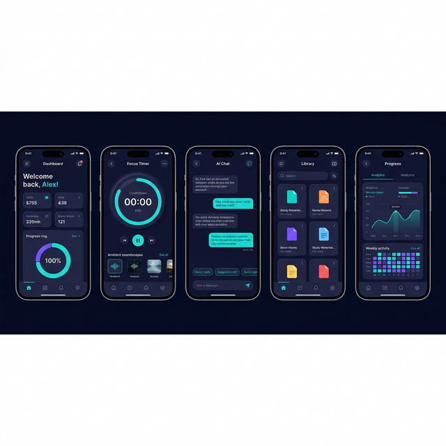

<p align="center">
  
</p>

<h1 align="center">📚 StudyMate</h1>

<p align="center">
  <em>Your AI-Powered Study Companion — Built with Jetpack Compose & Material 3</em>
</p>

<p align="center">
  
  
  
  
  
</p>

<p align="center">
  
  
  
</p>

---

## ✨ Overview

**StudyMate** is a beautifully crafted, feature-rich Android study companion app designed to help students organize, focus, and excel. With a stunning dark glassmorphic UI, AI-powered chat assistant, Pomodoro focus timer, and comprehensive progress analytics — StudyMate turns your phone into the ultimate study partner.

<p align="center">
  
</p>

---

## 🚀 Features

<table>
<tr>
<td width="50%">

### 🏠 Smart Dashboard
- Personalized greeting with real-time stats
- Quick access to tasks, sessions, and files
- **Animated progress ring** showing daily goals
- Urgent tasks panel with priority indicators
- Beautiful glassmorphic stat cards

</td>
<td width="50%">

### 🎯 Focus Timer
- **Pomodoro-style** countdown with animated ring
- Configurable session durations (15/25/45/60 min)
- 🎵 Ambient sound selector (Rain, Ocean, Forest, Café, Lo-fi)
- Focus mode banner with session tracking
- Today's focus stats at a glance

</td>
</tr>
<tr>
<td width="50%">

### 🤖 AI Study Chat
- Smart AI assistant for study help
- Quick action chips: *Summarize Notes, Quiz Me, Study Plan, Explain Concept*
- Real-time typing indicators
- Beautiful chat bubbles with glassmorphic design
- Context-aware responses

</td>
<td width="50%">

### 📂 Study Library
- Organize PDFs, Notes, Images & Videos
- **Grid-based** file browser with type icons
- Search & filter by category
- Favorite files for quick access
- Upload and manage study materials

</td>
</tr>
<tr>
<td colspan="2">

### 📊 Progress & Analytics
- **Overall completion** progress bar with animated fill
- Per-subject progress tracking with color-coded cards
- **Weekly activity heatmap** (GitHub-style)
- Study time tracking per subject
- Beautiful gradient charts and visualizations

</td>
</tr>
</table>

---

## 🎨 Design Philosophy

StudyMate features a **premium dark glassmorphic design** that's easy on the eyes during long study sessions:

| Element | Color | Preview |
|---------|-------|---------|
| Background | `#0A0E21` → `#1E1240` | 🌌 Deep Navy to Purple gradient |
| Primary Accent | `#13ECEC` | 🟢 Vibrant Teal glow |
| Secondary Accent | `#7C4DFF` | 🟣 Electric Purple |
| Success | `#69F0AE` | 🟩 Mint Green |
| Warning | `#FFAB40` | 🟠 Warm Amber |
| Cards | Semi-transparent | 🪟 Glassmorphic overlays |

> 💡 **Why Dark Theme?** Studies show dark themes reduce eye strain during extended reading sessions and conserve battery on OLED displays — perfect for students pulling late-night study sessions.

---

## 🏗 Architecture

StudyMate follows **Clean Architecture** principles with **MVVM** pattern:

```
📦 com.example.myandroidapp
├── 📂 data
│   ├── 📂 local           # Room Database & DAOs
│   │   ├── AppDatabase.kt
│   │   ├── StudyFileDao.kt
│   │   ├── StudySessionDao.kt
│   │   ├── StudyTaskDao.kt
│   │   └── SubjectDao.kt
│   ├── 📂 model           # Data entities
│   │   ├── ChatMessage.kt
│   │   ├── StudyFile.kt
│   │   ├── StudySession.kt
│   │   ├── StudyTask.kt
│   │   └── Subject.kt
│   └── 📂 repository      # Single source of truth
│       └── StudyRepository.kt
├── 📂 ui
│   ├── 📂 navigation      # Compose Navigation
│   │   ├── AppNavGraph.kt
│   │   └── Screen.kt
│   ├── 📂 screens
│   │   ├── 📂 aichat      # AI Chat feature
│   │   ├── 📂 dashboard   # Home dashboard
│   │   ├── 📂 focus       # Focus timer
│   │   ├── 📂 library     # File library
│   │   └── 📂 progress    # Analytics
│   └── 📂 theme           # Material 3 theming
│       ├── Color.kt
│       └── Theme.kt
├── MainActivity.kt
└── StudentCompanionApp.kt  # Application class
```

---

## 🛠 Tech Stack

| Category | Technology |
|----------|-----------|
| **Language** | Kotlin 2.0 |
| **UI Framework** | Jetpack Compose + Material 3 |
| **Architecture** | MVVM + Repository Pattern |
| **Database** | Room (Offline-first) |
| **Navigation** | Compose Navigation |
| **Async** | Kotlin Coroutines + Flow |
| **State Management** | StateFlow + collectAsStateWithLifecycle |
| **Preferences** | DataStore Preferences |
| **DI** | Manual (Application-level singletons) |
| **Animations** | Compose Animation APIs |
| **Build System** | Gradle (KTS) + Version Catalogs |
| **Compile SDK** | 36 (Android 16) |
| **Min SDK** | 24 (Android 7.0) |

---

## 📋 Prerequisites

- **Android Studio** Ladybug (2024.2.1) or newer
- **JDK 11** or higher
- **Android SDK 36**
- **Kotlin 2.0+**

---

## ⚡ Quick Start

### 1. Clone the repository
```bash
git clone https://github.com/ashgorhythm/StudyMate.git
cd StudyMate
```

### 2. Open in Android Studio
Open the project in Android Studio and let Gradle sync complete.

### 3. Run the app
Select a device/emulator and click **Run ▶️** or use:
```bash
./gradlew installDebug
```

---

## 📱 Screens at a Glance

| Screen | Description | Key Components |
|--------|-------------|----------------|
| 🏠 **Dashboard** | Home screen with stats & tasks | `GreetingSection`, `QuickStatsRow`, `ProgressRingSection`, `UrgentTasksSection` |
| 🎯 **Focus** | Pomodoro timer with ambiance | `TimerRing`, `TimerControls`, `DurationSelector`, `AmbientSoundSelector` |
| 🤖 **AI Chat** | Study assistant chatbot | `ChatBubble`, `TypingIndicator`, Quick action chips |
| 📂 **Library** | File management system | `FileCard`, Category filters, Search bar |
| 📊 **Progress** | Analytics & tracking | `OverallProgressBar`, `SubjectProgressCard`, `WeeklyHeatmap` |

---

## 🗄 Data Models

```kotlin
// 📝 Study Task — Track assignments & to-dos
StudyTask(title, subject, description, isCompleted, dueDate, priority)

// 📚 Subject — Organize by course
Subject(name, icon, colorHex, totalTopics, completedTopics, totalStudyMinutes)

// ⏱ Study Session — Track focus time
StudySession(subjectId, durationMinutes, date)

// 📁 Study File — Manage study materials
StudyFile(fileName, fileType, fileSize, isFavorite)

// 💬 Chat Message — AI conversation history
ChatMessage(content, isFromUser, timestamp)
```

---

## 🤝 Contributing

Contributions are welcome! Here's how to get started:

1. **Fork** the repository
2. **Create** a feature branch: `git checkout -b feature/amazing-feature`
3. **Commit** your changes: `git commit -m 'Add amazing feature'`
4. **Push** to the branch: `git push origin feature/amazing-feature`
5. **Open** a Pull Request

### Development Guidelines
- Follow **Kotlin coding conventions**
- Use **Compose best practices** (stateless composables, state hoisting)
- Write **meaningful commit messages**
- Add **KDoc comments** for public APIs

---

## 📄 License

This project is licensed under the **MIT License** — see the [LICENSE](LICENSE) file for details.

---

## 🙏 Acknowledgments

- [Jetpack Compose](https://developer.android.com/jetpack/compose) — Modern Android UI toolkit
- [Material Design 3](https://m3.material.io/) — Design system by Google
- [Room Database](https://developer.android.com/training/data-storage/room) — Robust local persistence
- [Kotlin Coroutines](https://kotlinlang.org/docs/coroutines-overview.html) — Asynchronous programming

---

<p align="center">
  <b>Made with ❤️ by <a href="https://github.com/ashgorhythm">ashgorhythm</a></b>
</p>

<p align="center">
  <sub>⭐ If you find StudyMate helpful, give it a star! ⭐</sub>
</p>
